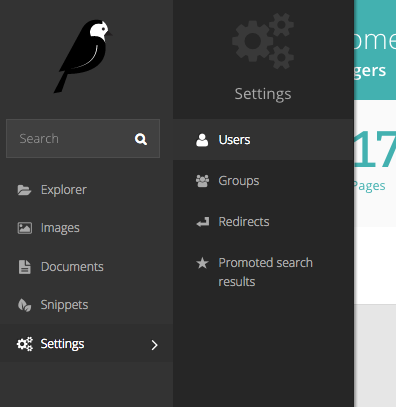

Managing users and roles
========================

User information and authentification is automatically managed based on existing LDAP profiles and can not be edited.
However, users need to be manually added to appropriate roles, giving them permission to work on parts of the site.

This is done via the 'Users' interface, which can be found in the Settings menu, accessible via the left-hand menu bar.

Clicking on a user's name will open their profile details.
Click the 'Roles' tab to edit the level of access your users have.
